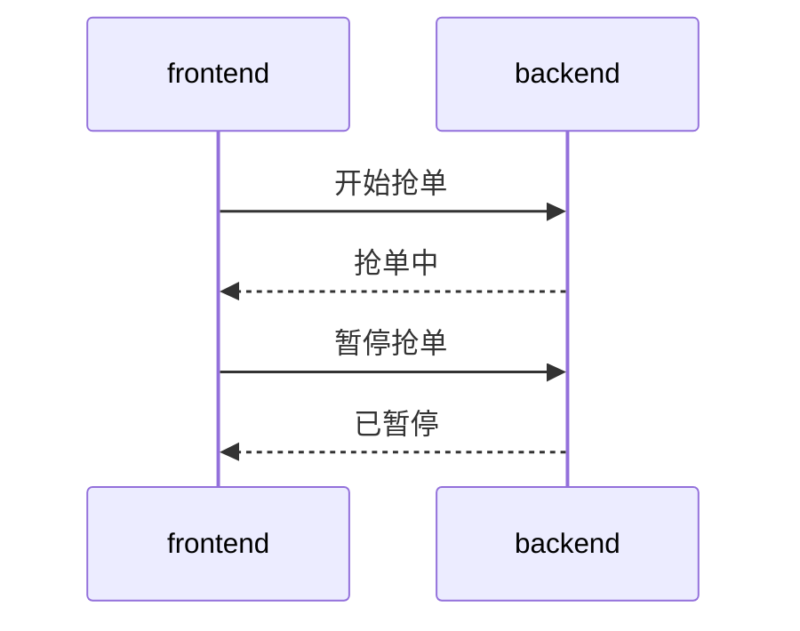

抢单软件设计说明

# 设计思路

基本思想：前后端分离

前端思路：tkinter+socket多线程

后端思路：socket+selenium多进程

# 时序图

整体时序

```mermaid
sequenceDiagram
    frontend->>backend: 开始抢单
    backend-->>frontend: 抢单中
    frontend->>backend: 暂停抢单
    backend-->>frontend: 已暂停
```

前端时序

GFOA_banckend.py